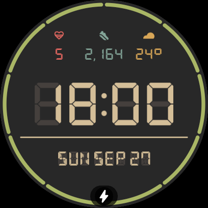
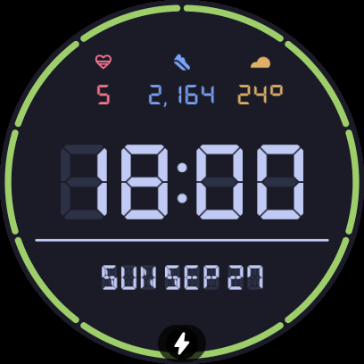
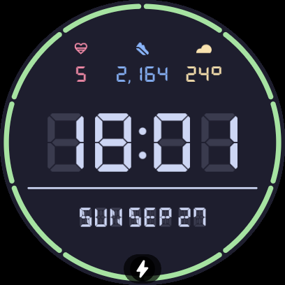
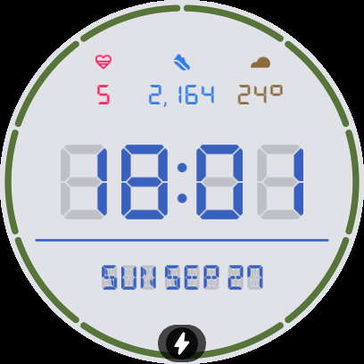
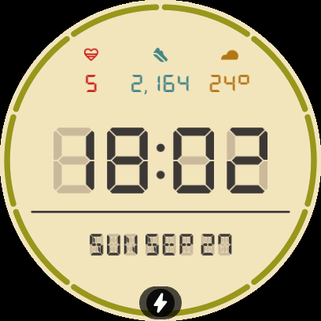
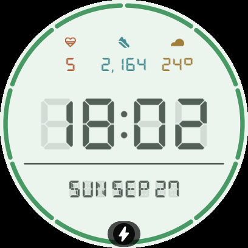

# Sicos Watch Face (Wear OS)

[-4285F4?logo=android&logoColor=white)](https://developer.android.com/training/wearables/wff)
[](https://developer.android.com/training/wearables/wff)
[](LICENSE)
[](shell.nix)

A custom, retro-futuristic digital watch face for **Wear OS 5** (optimized for the **Google Pixel Watch 3**), designed with the authentic **Gruvbox Material Dark** color palette and classic segmented LCD aesthetics.

Built entirely using declarative XML with Google's official **Watch Face Format (WFF)** standard — completely native, lightweight, and zero background battery drain from custom runtimes.

---

- **6 Curated Color Themes**:
  - Full support for both dark and light ambient aesthetics through the Wear OS watch face editor.
  - Dynamically recolors the canvas surface background, ghost LCD matrices, active digits, separator bar, complication accents, and the circular battery meter:
    - **Gruvbox Dark** (default): Classic retro warm cream on dark stone (`#282828`).
    - **Tokyo Night**: Vibrant neon blues and magenta accents over dark navy (`#1a1b26`).
    - **Catppuccin Mocha**: Pastel soothing tones on deep mocha (`#1e1e2e`).
    - **Tokyo Night Light**: Crisp daylight blue and soft accents on clean cool gray (`#e1e2e7`).
    - **Gruvbox Light Soft**: Warm vintage parchment (`#f2e5bc`) with earthy tones.
    - **Atelier Savanna Light**: Fresh herbal sage greens and warm ochres on light mint (`#ecf4ee`).

---

## Color Themes Gallery

| Gruvbox Dark (Default) | Tokyo Night | Catppuccin Mocha |
| :---: | :---: | :---: |
|  |  |  |
| **Tokyo Night Light** | **Gruvbox Light Soft** | **Atelier Savanna Light** |
|  |  |  |

---

## User Configuration Options

The watch face provides 4 interactive customization settings accessible directly via the watch face editor (by long-pressing the watch screen and tapping **Customize**) or through the **Google Pixel Watch smartphone companion app**:

1. **Color Theme (`theme_palette`)**:
   - Lets you cycle between the **6 curated color themes** shown in the gallery above (3 Dark, 3 Light).
   - Dynamically re-renders all visual layers: background, ghost segments, active digits, complications, and battery gauge.

2. **Native Icons (`native_icons`)**:
   - **Disabled (`FALSE`, default)**: Displays the custom, pixel-perfect internal icons crafted specifically for the watch face (`ic_heart`, `ic_steps`, `ic_temp`), tinted with exact fidelity to the active theme palette.
   - **Enabled (`TRUE`)**: Renders the dynamic monochromatic icons provided directly by Fitbit or third-party complication providers (`[COMPLICATION.MONOCHROMATIC_IMAGE]`).

3. **24-Hour Time Format (`time_format_24h`)**:
   - **Enabled (`TRUE`, default)**: Formats the digital clock in 24-hour military time (`hh:mm` 00–23).
   - **Disabled (`FALSE`)**: Formats the digital clock in 12-hour standard time (`hh:mm` 01–12).

4. **Display Profile (`display_profile`)**:
   - **Full Display (`full`, default)**: Complete rich retro layout with outer circular 10-segment battery gauge, 3 top complication columns, central digital clock, horizontal separator, and bottom alphanumeric date.
   - **Time Only (`time_only`)**: Ultra-clean minimalist interactive layout displaying solely the central 7-segment digital clock and the realistic ghost `88:88` LCD underlay (hiding complications, battery ring, separator, and date).

---

## Additional Features & Aesthetics

- **Retro LCD Typography**:
  - Main digital time (`hh:mm`) rendered with 7-segment digital font (`DSEG7 Classic`).
  - Active time accompanied by realistic inactive LCD "ghost" segments (`88:88`) in a subtle calibrated underlay.
  - Date (`DAY_OF_WEEK MONTH DAY`) rendered with 14-segment alphanumeric font (`DSEG14 Classic`) over full inactive 14-bar matrix cells.
- **10-Segment Circular Outer Battery Gauge**:
  - Outer perimeter gauge (`R=215px`, diameter `430px`) styled with 10 discrete segments (`dashIntervals="123.09 12"`).
  - Aligned symmetrically with 12:00 (gaps centered at 12:00 and 6:00).
  - Continuous proportional fill within the active segment (e.g. at 86%, segments 1–8 are full, segment 9 is 60% filled).
- **Dynamic & Customizable Complications (Top Row)**:
  - Three independent, centered complication columns (`ComplicationSlot` supporting `SHORT_TEXT`, `RANGED_VALUE`, and `EMPTY`):
    - **Slot 1 (Left)**: Defaults to Fitbit Cardio Load in theme accent color 3 (`#ea6962` in Gruvbox).
    - **Slot 2 (Center)**: Defaults to Steps Count in theme accent color 4 (`#83a598` in Gruvbox).
    - **Slot 3 (Right)**: Defaults to Current Weather Temperature in theme accent color 5 (`#d8a657` in Gruvbox).
  - Universal Fallback: If any slot is replaced with a custom provider, its icon is dynamically rendered and tinted to that column's theme accent.
- **Interactive Tap Shortcuts (`<Launch>`)**:
  - **Digital Clock Tap**: Immediately launches the system **Flashlight** application (`com.google.android.clockwork.flashlight`).
  - **Date Matrix Tap**: Opens the system **Calendar / Agenda** app (`CALENDAR`).
- **Power Efficiency & Minimalist Always-On Display (AOD)**:
  - Strict true black background (`#000000`) for zero OLED power draw on inactive pixels and burn-in prevention.
  - Automatically hides battery meter, complications, separator, and date.
  - Preserves only the central digital clock (`hh:mm`) and the inactive LCD ghost segments (`88:88`).

---

## Project Structure

```
├── .agents/
│   └── skills/
│       └── watchface-dev/     # LLM Agent development skill & WFF guidelines
├── app/
│   ├── src/main/
│   │   ├── AndroidManifest.xml # WFF Service & Wear OS Picker configuration
│   │   └── res/
│   │       ├── font/           # Binary TTF LCD fonts (DSEG7 & DSEG14)
│   │       ├── drawable-nodpi/ # Crisp pixel-art icons and preview assets
│   │       └── raw/
│   │           └── watchface.xml # Core Watch Face Format declarative layout
├── docs/                       # Comprehensive documentation
│   ├── ARCHITECTURE.md
│   ├── CHANGELOG.md
│   ├── DESIGN_SYSTEM.md
│   └── ENVIRONMENT.md
├── shell.nix                   # Reproducible NixOS development environment
├── build.gradle.kts
└── settings.gradle.kts
```

---

## Getting Started & Building

### Option 1: On NixOS (Recommended)

This repository includes a declarative `shell.nix` that provides OpenJDK 17, Android SDK (API 34), build-tools, platform-tools (`adb`), and Gradle without installing any global packages:

```bash
# Enter the isolated environment
nix-shell

# Inside the shell, build the debug APK
./gradlew assembleDebug
```

The compiled APK will be located at `app/build/outputs/apk/debug/app-debug.apk`.

### Option 2: Standard Android Environment

Requirements:
- **JDK 17**
- **Android SDK** with `platforms;android-34` and `build-tools;34.0.0`
- Environment variable `ANDROID_HOME` pointing to your Android SDK

```bash
./gradlew assembleDebug
```

---

## Installing to Pixel Watch via Wireless ADB (Sideloading)

Since this watch face is not yet published on Google Play, you can install and run it directly on your Pixel Watch using wireless debugging:

### 1. Enable Developer Options on your Watch
1. On your Pixel Watch, open **Settings**.
2. Tap **System** -> **About** -> **Versions**.
3. Tap **Build number** 7 times until you see the prompt *"You are now a developer!"*.

### 2. Enable Wireless Debugging
1. Go back to **Settings** -> **Developer options**.
2. Enable **ADB debugging**.
3. Scroll down and enable **Wireless debugging**.
4. Confirm that your watch and computer are connected to the **same Wi-Fi network**.

### 3. Pair the Watch with your Computer
1. In **Wireless debugging**, select **Pair new device**.
2. Note down the **IP address**, **Pairing Port**, and the **6-digit Wi-Fi pairing code**.
3. Run on your terminal (inside `nix-shell`):
   ```bash
   adb pair <WATCH_IP>:<PAIRING_PORT> <PAIRING_CODE>
   ```
   *(Example: `adb pair 192.168.1.50:44123 384834`)*

### 4. Connect to the Watch
1. Go back to the main **Wireless debugging** screen and check the **Port** listed under the IP address (this port is often different from the pairing port).
2. Connect to the device:
   ```bash
   adb connect <WATCH_IP>:<CONNECTION_PORT>
   ```
   *(Example: `adb connect 192.168.1.50:43479`)*
3. Verify connection:
   ```bash
   adb devices
   ```
   Your watch should appear in the list with status `device`.

### 5. Install and Activate the Watch Face
Build and install the APK directly to the connected watch:
```bash
./gradlew installDebug
```

Once installed, send a broadcast to notify the Wear OS picker to discover the new watch face:
```bash
adb shell am broadcast -a com.google.android.wearable.action.UPDATE_WATCH_FACES
```

Now, **long-press the watch screen**, scroll to the right, tap **+ (Add watch face)**, and select **Sicos Watch Face**.

---

## Updating & Iterating

When you make changes to [`app/src/main/res/raw/watchface.xml`](app/src/main/res/raw/watchface.xml):
```bash
./gradlew installDebug && adb shell am broadcast -a com.google.android.wearable.action.UPDATE_WATCH_FACES
```

To take an instant screenshot from your watch to verify layout:
```bash
adb exec-out screencap -p > watch_screen.png
```

---

## Documentation

Full architectural specifications, design guidelines, and changelogs are available under [`docs/`](docs/):
- [Architecture & Standards](docs/ARCHITECTURE.md)
- [Design System & Coordinates](docs/DESIGN_SYSTEM.md)
- [Changelog & Milestones](docs/CHANGELOG.md)
- [Environment Setup](docs/ENVIRONMENT.md)

---

## License

This project is licensed under the terms of the GNU General Public License v3.0 ([LICENSE](LICENSE)).
The embedded DSEG font family is licensed under the [SIL Open Font License 1.1](http://scripts.sil.org/OFL).
